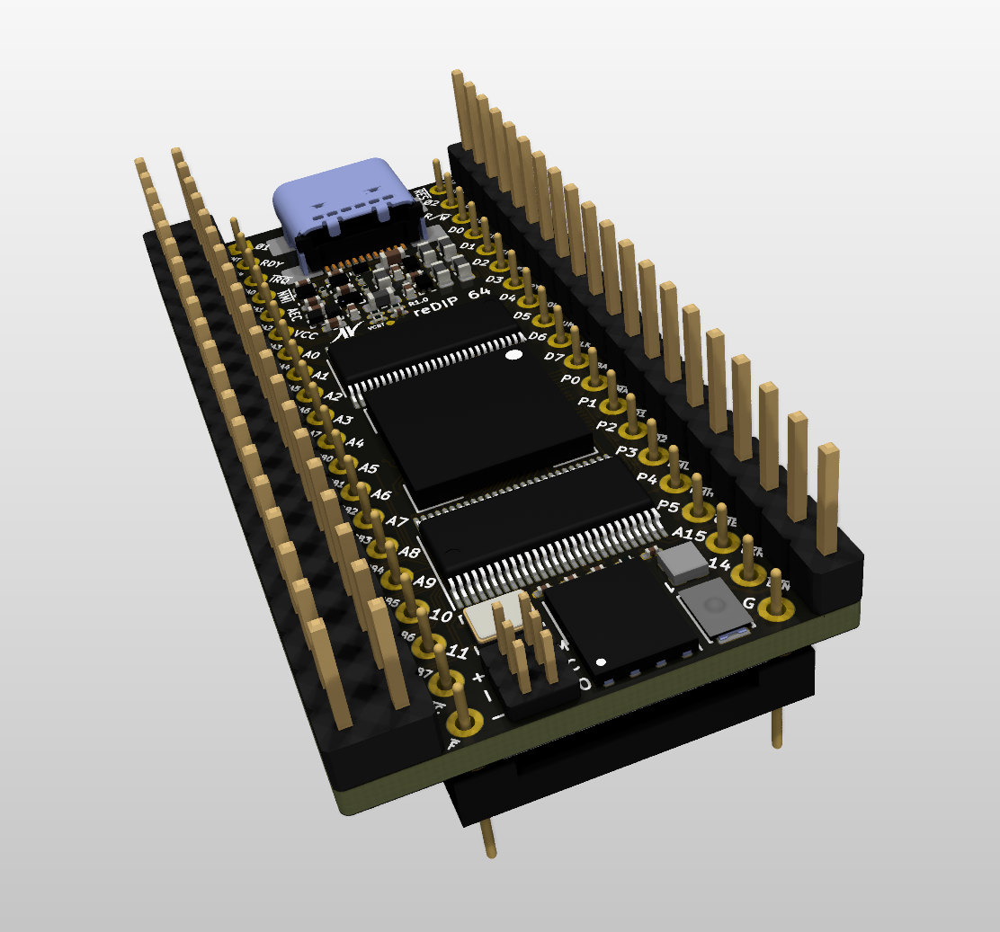

# reDIP 64

## Commodore 64 FPGA emulation platform

## Overview
The reDIP 64 is an open source hardware development board which combines the following in a tiny 25.40 x 50.80 mm footprint:

* Lattice ECP5-5G FPGA (LFE5UM5G-25)
* NXP PTN5110 USB PD TCPC PHY
* NXP SGTL5000 Audio Codec
* 128Mbit FLASH
* 128Mbit HyperRAM
* User RGB LED
* Push button
* USB-C receptacle for power, Full Speed USB, and DisplayPort (DP Alt Mode)
* Lots of 5V tolerant I/O

The reDIP 64 aims at functioning as

* A partial or full brain transplant for the venerable Commodore 64
* A "Retro computer on a chip" for anyone who would like to build their own retro computer
  with a minimum of additional components
* A versatile standalone generic FPGA platform with power, HID input, and video / sound output
  all handled through a single USB-C connector

Also check out the [reDIP SID](https://github.com/daglem/reDIP-SID), if you are interested in a platform for MOS 6581 / 8580 SID emulation in particular.

## General use

### I/O interfaces

#### 100 header pins:

* 5V input
* 5V output
* 3.3V output
* 92 FPGA GPIO
* 4 audio pins (stereo line input, stereo headphone output)
* GND

All FPGA I/O is 5V tolerant, and can drive 5V TTL.

#### JTAG:

A separate 6 pin header is provided for JTAG.

#### USB-C functions:

* 5V power
* USB Power Delivery (PD)
* FPGA Full Speed USB
* FPGA DisplayPort (DP Alt Mode)

## Commodore 64 compatibility

The board is pin compatible with the MOS 6510 MPU chip, and has additional pin headers to cover all the custom chips and I/O in the Commodore 64:

* 6510 MPU
* 6567 / 6569 VIC-II
* 2 x 6581 / 8580 SID
* 2 x 6522 CIA
* Cartridge port pins

For anyone wanting to experiment with a Commodore 64 setup, while avoiding damaged sockets and release of magic smoke:

* A 2A C64 power supply is recommended
* Use a 40 pin stamped DIP socket as an adapter for the MOS 6510 socket. Do not mount the board directly in a 6510 socket!

The idea is that one can start by mounting the reDIP 64 in a Commodore 64, replacing the 6510 MPU. This will make it possible to
communicate with the Commodore 64 via USB, to output video and sound via the USB-C connector (DP Alt Mode),
and to emulate a second SID chip.

Then, if one wishes to replace the VIC-II, the SID, or a CIA chip, the chip is removed, and wires are run from the reDIP 64 to the required socket pins for the custom chip.
Note that the VIC-II chip can only be replaced by additionally emulating all RAM chips.
Also, the PLA can only be replaced by emulating *all* custom chips, including ROM and RAM.

## Disclaimer

Please note that this is only my third board - rookie mistakes are probably made, and feedback is welcome.
The board is not quite finished yet, in particular the PCB stackup and routing must be adapted wrt. differential impedance for
DisplayPort. Speaking of which, I have not confirmed that USB DP Alt Mode can be made to work with only two DisplayPort
differential pairs ("lanes") - the official pin assignments specify either four DisplayPort differential pairs or two DisplayPort and two USB SuperSpeed differential pairs.
Hopefully someone can enlighten me :-)

## Board images

Board Front | Board Back
----------- | ----------
 | 
