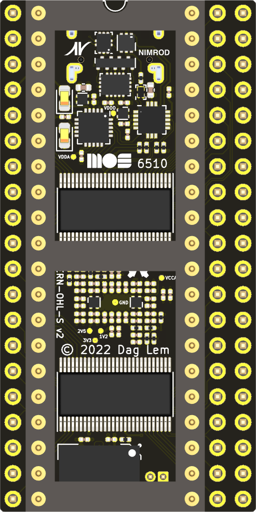

# reDIP 64

## Commodore 64 FPGA emulation platform

## Overview
The reDIP 64 is an open source hardware development board which combines the following in a tiny 25.40 x 50.80 mm footprint:

* Lattice ECP5-5G FPGA (LFE5UM5G-25)
* NXP PTN5110DHQ USB PD TCPC PHY
* NXP SGTL5000 Audio Codec
* 128Mbit FLASH
* 128Mbit HyperRAM
* RGB LED
* Push button
* USB-C receptacle for power, Full Speed USB, and DisplayPort (DP Alt Mode)
* Lots of 5V tolerant I/O

The reDIP 64 aims at functioning as

* A partial or full brain transplant for the venerable Commodore 64
* A "Retro computer on a chip" for anyone who would like to build their own retro computer
  with a minimum of additional components
* A versatile generic FPGA platform with power, HID input, and audio / video output
  all handled through a single USB-C connector

Also check out the [reDIP SID](https://github.com/daglem/reDIP-SID), if you are interested in a platform for MOS 6581 / 8580 SID emulation in particular.

## General use

### I/O interfaces

#### 100 header pins:

* 5V input
* 5V output
* 3.3V output
* 92 FPGA GPIO
* 4 audio pins (stereo line input, stereo headphone output)
* GND

All FPGA I/O is 5V tolerant, and can drive 5V TTL.

#### JTAG:

A separate 6 pin header is provided for JTAG.

#### USB-C functions:

* 5V power
* USB Power Delivery (PD)
* FPGA Full Speed USB
* FPGA DisplayPort (DP Alt Mode)

## Commodore 64 compatibility

The board is pin compatible with the MOS 6510 MPU chip, and has additional pin headers to cover all the custom chips and I/O in the Commodore 64:

* 6510 MPU
* 6567 / 6569 VIC-II
* 2 x 6581 / 8580 SID
* 2 x 6526 CIA
* Cartridge port signals
* Menu / freeze button

For anyone wanting to experiment with a Commodore 64 setup, while avoiding blown fuses, damaged sockets, and release of magic smoke:

* A 2A C64 power supply is recommended
* Use a 40 pin stamped DIP socket as an adapter for the MOS 6510 socket. Do not mount the board directly in a 6510 socket!

The idea is that one can start by mounting the reDIP 64 in a Commodore 64, replacing the 6510 MPU. This will make it possible to
communicate with the Commodore 64 via USB, to output audio and video via the USB-C connector (DP Alt Mode),
and to emulate a second SID chip.

Then, if one wishes to replace the VIC-II, the SID, or a CIA chip, the chip is removed, and wires are run from the reDIP 64 to the corresponding socket pins for the custom chip.

Note that unless suggested GPIO is repurposed for other functions, the VIC-II can only be replaced by additionally emulating all RAM chips,
and the PLA can only be replaced by emulating *all* custom chips, including ROM and RAM.

## Building a retro computer

Power, HID input, and audio / video can all be handled via the USB-C port, hence the reDIP 64 is in fact capable of operating as a retro computer all on its own.
Just connect the reDIP 64 to a DisplayPort monitor, either directly or via an USB hub, and add a keyboard and any other HID input devices.
Now, all that is needed is an FPGA implementation of a retro computer :wink:

To create a fully functional retro computer, i.e. with I/O which can interface with original perhiperals, physical connectors and glue logic must be added to the mix.
This can make for some fun projects!

## Other FPGA projects

Go wild! :smile:

## Disclaimer

Please note that this is only my third board - rookie mistakes are probably made, and feedback is welcome.

## Board images

Board Front | Board Back
----------- | ----------
 | 
