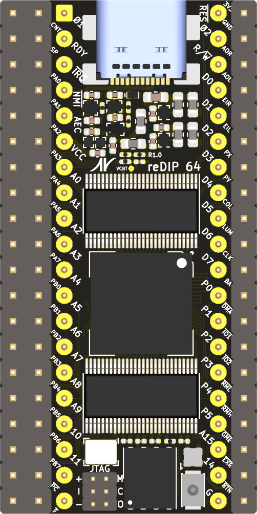

# reDIP 64

## Commodore 64 FPGA emulation platform

## Overview

The reDIP 64 is an open source hardware development board which
combines the following in a tiny 25.40 x 50.80 mm footprint:

* Lattice ECP5-5G FPGA (LFE5UM5G-25)
* NXP PTN5110NHQ USB PD TCPC PHY
* NXP SGTL5000 Audio Codec
* 128Mbit FLASH
* 128Mbit HyperRAM
* RGB LED
* Push button
* USB-C receptacle for power, Full Speed USB, and DisplayPort (DP Alt Mode)
* Lots of 5V tolerant I/O

The reDIP 64 aims at functioning as

* A partial or full brain transplant for the venerable Commodore 64
* A "Retro computer on a chip", which can be used stand-alone or in
  custom retro computer builds
* A versatile generic FPGA platform with power, HID input, and audio /
  video output all handled through a single USB-C connector

Designs for the ECP5 FPGA can be processed by
[yosys](https://github.com/YosysHQ/yosys/) and
[nextpnr](https://github.com/YosysHQ/nextpnr/).

Also check out the [reDIP SID](https://github.com/daglem/reDIP-SID),
if you are interested in a platform for MOS 6581 / 8580 SID emulation
in particular.

## General use

### I/O interfaces

#### 100 header pins:

* 5V input
* 3.3V output
* 92 FPGA GPIO
* 5 audio pins (stereo line input, stereo line output, GND)
* GND

All FPGA I/O is 5V tolerant, and can drive 5V TTL.

Note that the audio line inputs are not AC coupled - AC coupling must
be externally added for audio applications. Without external AC
coupling, the line inputs can conceivably be used as generic ADCs.

#### JTAG:

A separate 6 pin header is provided for JTAG.

#### USB-C functions:

* 5V power
* USB Power Delivery (PD)
* FPGA Full Speed USB
* FPGA DisplayPort (DP Alt Mode)

## Commodore 64 compatibility

The board is pin compatible with the MOS 6510 / 8500 MPU chip, and has
additional pin headers to cover all the custom chips and I/O in the
Commodore 64:

* 6510 / 8500 MPU
* 6567/6569 / 8562/8565 VIC-II
* 6581 / 8580 SID (x 2)
* 2 x 6526 CIA
* Cartridge port signals
* Menu / freeze button

For anyone interested in experimenting with a Commodore 64 setup,
while avoiding blown fuses and a broken reDIP 64 board:

* A 2A C64 power supply is recommended
* Be careful not to apply force to SMD components on insertion and removal

The idea is that one can start by mounting the reDIP 64 in a Commodore
64, replacing the 6510 / 8500 MPU. This will make it possible to communicate
with the Commodore 64 via USB, to output audio and video via the USB-C
connector (DP Alt Mode), and to emulate a second SID chip.

Then, if one wishes to replace the VIC-II, the SID, or a CIA chip, the
custom chip is removed, and wires are run from the reDIP 64 to the
corresponding socket pins for the custom chip.

Note that the audio line outputs cannot drive the C64 audio output
stage directly, however an audio output may be connected directly to
pin 3 of the C64 audio/video connector (preferably removing or cutting
a pin on C13 in the C64).

Also note that unless suggested GPIO is repurposed for other
functions, the VIC-II can only be replaced by additionally emulating
all RAM chips, and the PLA can only be replaced by emulating *all*
custom chips, including ROM and RAM.

The MOS 8502 MPU used in the Commodore C128 has a similar pinout to
the MOS 6510. Since the same pins are used for power, the reDIP 64 can
conceivably also be used in a C128.

## Retro computer on a chip

Power, HID input, and audio / video can all be handled via the USB-C
port, hence the reDIP 64 is in fact capable of operating as a retro
computer all on its own. Just connect the reDIP 64 to a DisplayPort
monitor, either directly or via an USB hub, and add a keyboard and any
other HID input devices. Now, all that is needed is an FPGA
implementation of a retro computer :wink:

To create a fully functional retro computer, i.e. with I/O which can
interface with original perhiperals, physical connectors and glue
logic must be added to the mix. This can make for some fun projects!

## Other FPGA projects

The board can be of course also be used to experiment with e.g.

* DisplayPort audio / video
* Analog audio
* USB Power Delivery
* Interfacing with 5V TTL
* RISC-V and other CPU architectures
* Other SoC projects

## Disclaimer

Please note that this is only my third board - rookie mistakes are
probably made, and feedback is welcome.

## Board images

Board Front | Board Back
----------- | ----------
 | 
